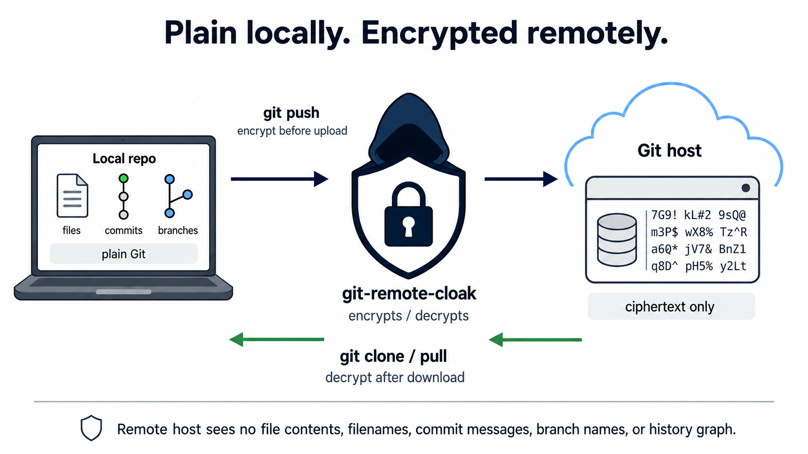

# git-remote-cloak

[](https://github.com/b4ryon/git-remote-cloak/actions/workflows/ci.yml)

A git remote helper that stores an end-to-end encrypted mirror of a git
repository on any ordinary git host. The host sees only opaque
AEAD-encrypted blobs: no file contents, no filenames, no commit messages,
no branch names, no history graph. Local repositories stay plain git.



## Good fit

cloak suits small, sensitive, mostly-text repositories shared across a few
trusted machines that hold the key:

- Encrypted notes / knowledge bases (Obsidian vaults, markdown zettelkasten,
  research notebooks) synced across your machines.
- Versioned secrets and config, solo or small team (certs, `.env`,
  ansible-vault material, password-store data, dotfiles-with-secrets).
- Code you would rather not donate to someone else's model training.
- Private journaling and high-sensitivity writing (medical, legal,
  source-protection drafts).
- Confidential small-document collaboration through a host you would rather
  not trust with plaintext.
- Off-site encrypted backup of small sensitive datasets.
- A tamper- and rollback-evident mirror on an untrusted host.

## Not a good fit

- Source you want host-side features on (CI, pull requests, blame, code
  search), the host sees only ciphertext; use a normal private repo.
- Large or binary-heavy repos, they work, but inefficiently (whole-pack
  ciphertext, no host-side dedup or partial fetch, no git-LFS). Host file-size
  limits apply to the encrypted packs: GitHub, for example, rejects any pushed
  file over 100 MB and caps a single push at ~2 GB, so a pack exceeding those
  will fail to push. cloak catches the per-file case before upload and refuses
  with the offending file named (`cloak.maxPackBytes`, default 100 MiB).
- Many users needing differentiated access, one shared key, no per-user ACLs.
- Hiding traffic rather than content, repo existence, owner, push timing, and
  pack sizes/counts still leak.
- Cases where you already trust the host, a plain private repo is simpler.

## Replacement for git-remote-gcrypt

A ground-up replacement for `git-remote-gcrypt` that fixes its known design
problems:

- Concurrent pushes are safe by construction (compare-and-swap via git's
  fast-forward and stale-info checks), not self-healed after silent clobbers.
- No GPG: encryption uses the age v1 format with a single shared symmetric
  key (ChaCha20-Poly1305), stored in the macOS Keychain or a key file.
- Host rollback/replay of old state is detected and refused (monotonic
  generation counter), not silently accepted.
- Substituting another repository's encrypted state under the same key is
  refused, not merely warned about: a random repository identity is bound
  inside the AEAD manifest and pinned (trust-on-first-use); a mismatch is a
  hard error needing an explicit override.
- Pack consolidation is geometric, with no periodic full-history re-upload.
- Errors are reported as what they are (auth vs network vs missing repo vs
  tamper vs rollback).

## Usage

### Install

Prerequisites: Go 1.26+ and git. On macOS, install the Xcode command line tools
(`xcode-select --install`) for the cgo Keychain/Touch ID key backend; Linux
builds are pure Go and use a key file.

```
git clone https://github.com/b4ryon/git-remote-cloak.git
cd git-remote-cloak
make install                   # builds + installs git-remote-cloak and the
                               # git-cloak symlink into ~/bin (override PREFIX=).
                               # Version is derived from the latest git tag.
```

Both names must be on your PATH: git runs `git-remote-cloak` for `cloak::` URLs,
and `git cloak ...` resolves to the `git-cloak` symlink. Add the PATH line to
your shell profile so new shells (and GUI apps) inherit it, not just the current
shell:

```
export PATH="$HOME/bin:$PATH"  # put this in ~/.zshrc / ~/.bashrc, then open a NEW shell
git cloak version              # verify the CLI: prints e.g. "git-cloak v0.2.8"
command -v git-remote-cloak    # verify git can find the helper for cloak:: URLs
                               # (must print a path; if empty, the PATH is wrong)
```

The `command -v` check matters because git resolves the helper itself: if
`git-remote-cloak` is not on PATH, `git cloak version` can still pass while a
later `git clone cloak::...` fails with "helper not found". The full end-to-end
check is a `cloak::` clone (or `git ls-remote cloak::<your-host>`) once you have
a key and a host repo configured.

Alternative: `go install github.com/b4ryon/git-remote-cloak/cmd/git-remote-cloak@v0.2.8`,
then `ln -sf git-remote-cloak "$(go env GOPATH)/bin/git-cloak"`.

### First repository

```
# first machine
git cloak keygen                     # generate the shared master key
git cloak key export                 # back it up to two safe places (see note)

# optional: make the current folder a git repo (skip if it already is one)
git init -b main                     # git < 2.28: git init && git branch -M main
git add -A && git commit -m "initial commit"

# optional: create the EMPTY, private repo on the host first
gh repo create you/private-repo --private   # no README/license; or create it in the web UI

git remote add origin cloak::git@github.com:you/private-repo.git
git push -u origin main

# second machine
git cloak key import                 # paste the exported key
git clone cloak::git@github.com:you/private-repo.git
```

The key lives only on your machines (the host holds only ciphertext), so losing
every copy makes the data unrecoverable: back the key up before pushing real
data, and keep the repository private. cloak hides contents, filenames, and
history structure, but not the repo's existence, owner, or push metadata (pack
sizes, count, and timing).

### Everyday use

There is no separate sync command: once the `cloak::` remote is configured, use
git as usual. `git push`, `git pull`, `git fetch`, and `git clone` transparently
encrypt outbound and decrypt inbound. (Scheduled/background auto-sync is not part
of the tool.)

### Obsidian vault sync (example)

A vault is just a folder of files, so there is nothing Obsidian-specific to
install on cloak's side. After the key and remote setup above, in your vault:

```
cd /path/to/YourVault
git init
printf '.obsidian/workspace*\n.obsidian/cache\n.trash/\n.DS_Store\n' > .gitignore
git remote add origin cloak::git@github.com:you/notes-private.git
git add -A && git commit -m "initial vault" && git push -u origin main
```

For automatic commit-and-sync, use the [Obsidian Git](https://github.com/Vinzent03/obsidian-git)
community plugin: on desktop it shells out to your system git, so cloak runs
transparently. Ensure `git-remote-cloak` is on the PATH Obsidian sees, macOS
GUI apps get a minimal PATH, so install it under e.g. `/usr/local/bin`
(`make install PREFIX=/usr/local/bin`), not just `~/bin`. Mobile Obsidian is
unsupported: its Git plugin uses a pure-JavaScript git (isomorphic-git) that
cannot run remote helpers.

macOS code-signing note: the Keychain key backend binds its access control to
the helper's code signature. The build default is an ad-hoc signature, which
changes on every rebuild and invalidates that access, so each rebuild triggers
a fresh Touch ID / password prompt on the next sync. To avoid recurring prompts,
build with a stable self-signed code-signing certificate
(`make install CLOAK_SIGN_ID=<cert-name>`). The file key backend
(`cloak.keyRef=file:...`) is unaffected.

### Operator commands (`git cloak`)

- `status`, remote generation, repo id, packs, applied state.
- `repack` / `rekey`, full consolidation / re-encrypt under a new key.
- `accept-rollback` / `accept-repo-change`, one-shot overrides for a detected
  generation regression or repository-identity change (user-presence gated).
- `key export [--force-insecure]` / `key import` / `key delete`, key transfer,
  backup, and removal (delete requires a typed YES confirmation).

### Configuration

git config (`cloak.*`):

- `keyRef`, where the master key lives. The default differs by OS:
  `keychain:default` (macOS Keychain) and `file:~/.config/cloak/keys/default`
  (Linux/other). Each machine uses its own platform default, so a Mac+Linux pair
  works without touching this. Set `cloak.keyRef` explicitly only if you store
  the key elsewhere, and use the right form for that machine's platform
  (`keychain:<name>` or `file:<path>`).
- `geometricFactor`, pack-consolidation aggressiveness (default 2; `0` disables).
- `pushRetries`, compare-and-swap retry budget under concurrent pushes (default 5).
- `branch`, the backend branch name on the host (default `cloak`).
- `maxPackBytes`, the largest encrypted pack (one host file) cloak will publish.
  A push or repack that would exceed it is refused *before upload*, naming the
  largest files so you know what to shrink, and leaving no partial upload.
  Default `104857600` (100 MiB, GitHub's per-file hard cap); set `0` to disable
  (a self-hosted host with no limit), or raise it for a host with a higher cap.
  A consolidation that would cross the limit is skipped rather than failing the
  push. If the limit is left unset/too high and the host rejects the push, cloak
  still reports it clearly as a "pack too large for host" error.

Environment: `CLOAK_GIT_TIMEOUT` (git subprocess timeout, default 120s; `0`/`off`
disables), `CLOAK_LOG` (per-repo debug log level).

### Trust model and accepted risks

cloak hides repository contents, filenames, and history structure from the host;
a few properties are accepted trade-offs rather than protected:

- **Metadata leaks.** The host still sees the repo's existence, owner, total
  size, pack count, and push timing. The backend branch is named `cloak` by
  default, which fingerprints the repo as a cloak target; rename it with
  `git config cloak.branch <name>` if you would rather not advertise the tool.
- **First contact is trust-on-first-use.** On a fresh clone (or after the local
  `.git/cloak/<remote>/` state is deleted) there is no pin yet, so the first
  manifest that decrypts under your key is trusted. A host that tampered with the
  *initial* state could serve any state that validates under the shared key. To
  close this, compare `git cloak status` (generation and manifest hash) against
  the other machine before trusting a brand-new clone.
- **Key export can be scripted.** `git cloak key export` is gated by a
  user-presence (Touch ID) prompt, but `--force-insecure` deliberately skips it
  for non-interactive backups. Any process running as you with that flag can read
  the raw key, by design, treat the key like any other top-level secret.

## Build and test

```
make build              # bin/git-remote-cloak + git-cloak symlink
make test               # unit tests
make test-integration   # hermetic integration + security suites (real git)
make test-race          # race detector across in-process + integration suites
make test-darwin        # Keychain backend tests
make vuln               # govulncheck (needs network to the Go vuln database)
make test-e2e           # live tests against a scratch GitHub repo (CLOAK_E2E=1)
make check              # vet + lint + vuln + test + test-integration + test-darwin
```

## Acknowledgments

cloak builds on:

- [age](https://age-encryption.org) (`filippo.io/age`) by Filippo Valsorda and
  contributors, the encryption format and the stanza/STREAM primitives.
- [`golang.org/x/crypto`](https://pkg.go.dev/golang.org/x/crypto),
  [`golang.org/x/term`](https://pkg.go.dev/golang.org/x/term), and
  [`golang.org/x/text`](https://pkg.go.dev/golang.org/x/text) by the Go Authors,
  ChaCha20-Poly1305 and HKDF for the cloak/v1 stanza, terminal detection for the
  user-presence gate, and Unicode handling in the tests.
- [git](https://git-scm.com), cloak is a remote helper; git does all local
  object storage and transport.

Inspired by: [git-remote-gcrypt](https://github.com/spwhitton/git-remote-gcrypt),
whose design this project set out to improve on.

## License

MIT, see LICENSE.
